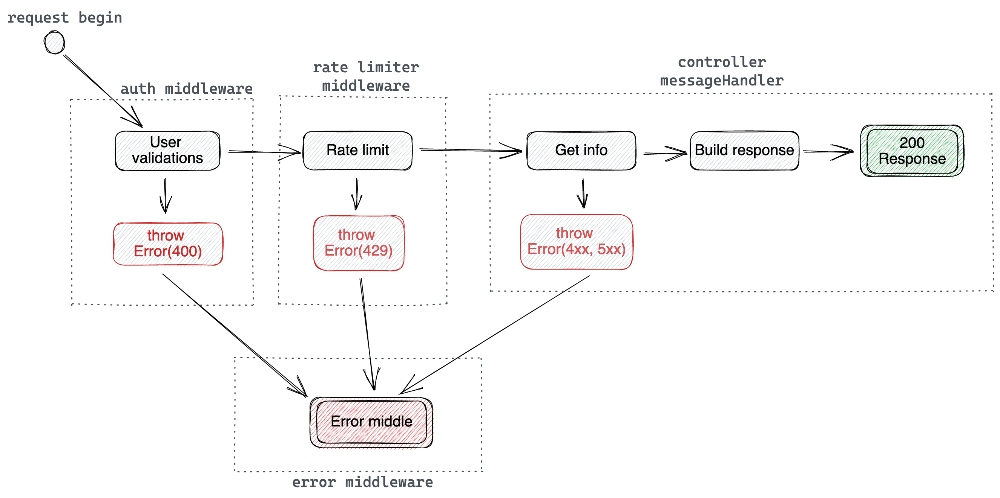

# Challenge Rate Limiter
El objetivo de este challenge es montar un server que exponga un endpoint `GET /message` a partir del cual se devuelva un mensaje del servicio de [Fuck Off as a Service](https://www.foaas.com/).

El mensaje a obtener de este servicio esta totalmente a eleccion del candidato. 

La unica restriccion es que un usuario que consuma este endpoint pueda utilizarlo HASTA 5 veces dentro de un periodo de 10 segundos. 

No es necesario modelar ningun tipo de usuario, se puede utilizar el metodo de autenticacion que la persona mejor considere. Ninguna parte de la autenticacion sera tomada en cuenta para la evaluacion del ejercicio asi que se puede implementar algo tan simple como un header con un userId inventado.


> Se espera que se implemente el llamado a la API de foaas.

> Se espera que se implemente la lógica del limiter.

## Instalation
1. Configurar la versión adecuada de NodeJS
```
nvm use
```
2. Instalar dependencias
```
npm install
```
3. Levantar la aplicacion localmente
```
npm run dev
```
### Other commands
- Ejecutar los tests (junto con el linter): `npm test`
- Ejecutar api en produccion: `npm start`
- Generar JS a partir del codigo Typescript: `npm run build`
- Ejecutar el Linter (es-lint): `npm run lint`

## Examples
```curl
curl -H "User-Id: 11111" -X GET "http://localhost:4000/"
```
> Para obtener una respuesta mockeada, simplemente agregar el header `x-mocks: true`:
```curl
curl -H "User-Id: 1" -H "x-mocks: true" -X GET "http://localhost:4000/"
```

## Design decisions
La siguiente figura muestra la lógica que se utiliza para manejar el request `GET /message`. \
Dicha lógica se expresa como una máquina de estados:



Estados:
- `request begin (idle)`: estado inicial. Transiciona al estado `user validations`.
- `user validations`: valida que el usuario esté autenticado. En caso de estarlo, transiciona al estado `rate limit`; caso contrario, va hacia el estado `throw 400`.
- `rate limit`: valida que el usuario cumpla con la política del límite de requests. En caso de cumplir, transiciona al estado `get info`; caso contrario, transiciona hacia `throw 429`.
- `get info`: obtiene los datos de la API Foaas. Si falla el apicall transiciona hacia `throw 4xx 5xx`, mientras que si el apicall es exitoso, transiciona hacia `build response`.
- `build response`: arma la firma que reciben los clientes de la API. Luego, transiciona hacia `response 200`.
- `throw 400`: genera un error de validación de autenticación y transiciona al `error middleware`.
- `throw 429`: genera un error 'to many requests' y transiciona al `error middleware`.
- `throw 4xx 5xx`: genera un error utilizando la respuesta del restclient y transiciona al `error middleware`.
- `response 200`: estado final. Envia la respuesta al cliente.
- `error middle`: estado final. Envia el error al cliente.

### Other decisions:
- [Convenciones](docs/conventions.md)
- [Dependencias](docs/dependencies.md)
- [Métricas](docs/metrics.md)
- [Middlewares](docs/middlewares.md)
