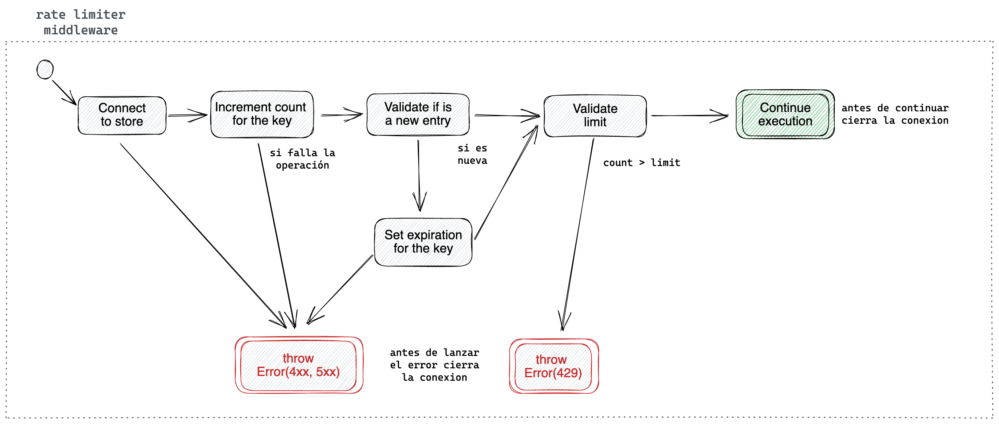

## Custom Express Middlewares
Se crearon varios middlewares de ExpressJS para aislar ciertas lógicas de la API.

### Authentication Middeware
Aisla la lógica para comprobar si un usuario esta debidamente autenticado. En este caso, solamente valida que el request tenga el header `user-id`.

### Error Middeware
Es responsable de normalizar los errores antes de responder al cliente. Dispara los logs y métricas necesarias, entre las cuales se encuentra [recordInternalApiResponse](#recordexternalapiresponse).

### Not Found Middeware
Es responsable de gestionar las rutas inexistentes de la API.

### Rate Limiter Middeware
Es el responsable de controlar y hacer respetar el límite.
> Se generó una [interfaz](../src/types/store.ts) para abstraer el concepto "store". A modo de ejemplo, se dejaron dos implementaciones: [MapStore](../src/helpers/stores/map.ts) y [RedisStore](../src/helpers/stores/redis.ts).

> Actualmente solamente se guarda cuantos request hizo un usuario dentro de la ventana de tiempo. De ser necesario, se puede extender para guardar otro tipo de información, por ejemplo los timestamp de cada request realizado.

La siguiente figura muestra la lógica implementada, la cual se expresa como una máquina de estados:

Estados:
- `(idle)`: estado inicial. Transiciona al estado `connect to store`.
- `conect to store`: hace el proceso de conectarse al store. Si falla dicho proceso, transiciona hacia `throw 4xx 5xx`; caso contrario, transiciona al estado `increment count for the key`.
- `increment count for the key`: dada una key, incrementa el valor de su contador. Si no existe, lo crea antes de incrementar; luego guarda la entrada modificada en el store. En caso de que falle alguno de los procesos, transiciona al estado `throw 4xx 5xx`; caso contrario, transiciona hacia `validate if is a new entry`.
- `validate if is a new entry`: si la entrada es nueva (creada en el paso anterior), transiciona hacia `set expiration for the key`, mientras que si la entrada existia previamente, transiciona hacia `validate limit`.
- `validate limit`: dada una key, valida que el contador (correspondiente a esa key) sea menor al límite. En caso de cumplirse, transiciona hacia `continue execution`; caso contrario, transiciona hacia `throw 429`.
- `continue execution`: estado final. Continua el manejo del request, para que lo tome otro middleware de ExpressJS o un [controller](conventions.md#controllers).
- `set expiration for the key`: dada una key, configura el TTL de la entrada correspondiente y transiciona al `validate limit`. Si falla el proceso, transiciona a `throw 4xx 5xx`.
- `throw 429`: estado final. Genera un error 'to many requests' y lo lanza. El mismo va a ser atrapado por el [middelware de Error](#error-middeware).
- `throw 4xx 5xx`: estado final. Genera un error utilizando la respuesta del restclient y lo lanza. El mismo va a ser atrapado por el [middelware de Error](#error-middeware).